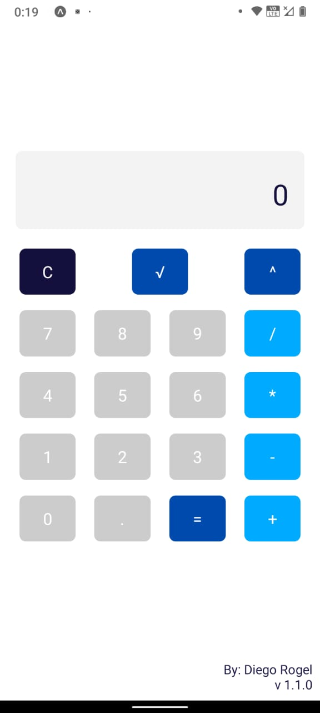
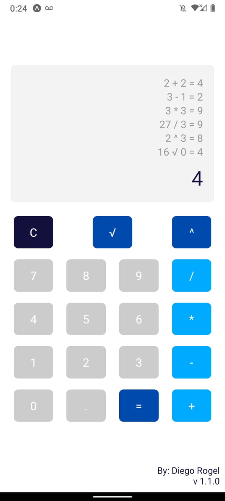

# Materia
APLICACIONES MOVILES II

# Docente
ING MEJIA DIAZ HUGO ALEXANDER

# Estudiante
ROGEL CALLE DIEGO ARAMANDO

# Examen
Diseñe y desarrolle una aplicación móvil de calculadora para Android utilizando React Native y TypeScript que permita realizar las siguientes operaciones matemáticas: 
  1. Suma 
  2. Resta
  3. Multiplicación 
  4. División 
  5. Raíz Cuadrada 
  6. Potencia 

# Calculadora React Native
Una calculadora desarrollada en React Native con TypeScript para Android que permite realizar operaciones matemáticas básicas y avanzadas. Incluye un historial de cálculos, manejo de errores y diseño responsive.

## Características
- Operaciones básicas: Suma, Resta, Multiplicación, y División.
- Operaciones avanzadas: Raíz Cuadrada y Potencia.
- Cálculos en tiempo real a medida que se ingresa la información.
- Historial de cálculos realizados durante la sesión.
- Manejo de errores: evita divisiones por cero y detecta entradas inválidas.
- Diseño responsive y colores personalizables para cada tipo de botón:
  - Botones de números: gris.
  - Botones de operaciones: celeste.
  - Botón de igual y operaciones avanzadas: azul.

## Capturas de Pantalla

**Pantalla Principal**  
> 
> 
<video controls src="example/03-VideoUsoAplicativo.mp4" title="Video Uso Aplicativo"></video>
> 

## Guía de Uso

1. **Ingresar Números**: Usa los botones numéricos (0-9) para ingresar números en la calculadora.
2. **Operaciones Básicas**: Selecciona los botones de suma, resta, multiplicación o división para realizar operaciones entre el número ingresado y el valor anterior.
3. **Operaciones Avanzadas**:
  - **Raíz Cuadrada**: Calcula la raíz cuadrada del número actual.
  - **Potencia**: Eleva el valor anterior al número actual como exponente.
4. **Historial**: Muestra los cálculos realizados durante la sesión actual. Al presionar "C" se borra el historial y el valor en pantalla.
5. **Manejo de Errores**: Si intentas dividir entre cero o ingresas valores no válidos, la aplicación mostrará un mensaje de error.
6. **Limpiar**: Usar el botón C para borrar el último dato ingresado, si necesita realizar una nueva operación y no quiere reutilzar un valor ingresado para otra operación.

## Instrucciones de Instalación

### Requisitos Previos

1. **Node.js y npm**: Asegúrate de tener [Node.js](https://nodejs.org/) instalado (la versión LTS es recomendada).
2. **React Native CLI**: Necesitarás instalar el CLI de React Native globalmente. Ejecuta:
  npm install -g react-native-cli
3. **Expo (opcional):** Si prefieres usar Expo para desarrollo más rápido, instálalo con:
  npm install -g expo-cli

### Pasos de Instalación
1. **Clonar el Repositorio**: Clona el repositorio en tu máquina local:
  git clone https://github.com/oni-DARC/moviles2_taller_drogel.git
2. **Instalar Dependencias**: Instala las dependencias del proyecto usando npm
  npm install
3. **Ejecutar la Aplicación:** Inicia la aplicación en tu emulador o dispositivo
  expo start

### Estructura del Proyecto
- **src/screens/CalculadoraScreen.tsx**: Pantalla principal de la calculadora.
- **src/components/BotonOperacion.tsx**: Componente de los botones de la calculadora.
- **src/components/DisplayResultado.tsx**: Componente que muestra el valor en pantalla y el historial de cálculos.
- **src/utils/calculadora.ts**: Funciones de cálculo para cada operación matemática.

### Personalización
Si deseas modificar los colores o estilos, puedes ajustar las propiedades color en el archivo CalculadoraScreen.tsx en cada BotonOperacion.

### Notas
Las siguientes comandos, fueron utilizados para la creación y subida del proyecto.
En cmd
cd D:\ITSQMET\13-APLICACIONES_MOVILES_II\ejercicios
npx expo init moviles2_examen_drogel
	blank (Typescript)
npm install -g react-native-cli
npm install @react-navigation/native
npm install @react-navigation/stack
npm install react-native-gesture-handler
npx expo start

moviles2_examen_drogel

https://github.com/oni-DARC/moviles2_examen_drogel.git

echo "# moviles2_examen_drogel" >> README.md
git init
git add README.md
git commit -m "first commit"
git branch -M main
git remote add origin https://github.com/oni-DARC/moviles2_examen_drogel.git
git push -u origin main

Generar apk
expo login
npm install -g eas-cli
npx expo prebuild
npm install expo-system-ui
eas login
// crear el eas.json e incluir el "eas:android":"eas build -p android --profile preview" en el package.json
npm run eas:android

## Contacto
Para cualquier pregunta o sugerencia, por favor contacta a diego.a.rogel@gmail.com
